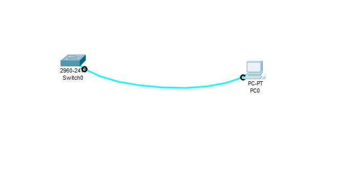
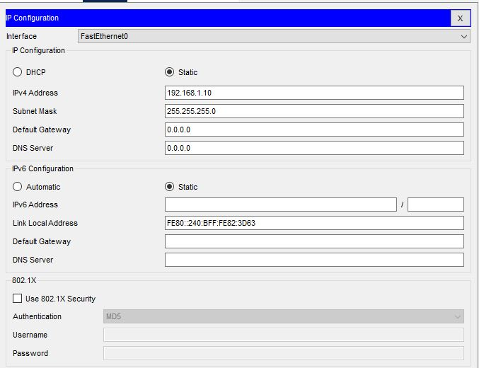
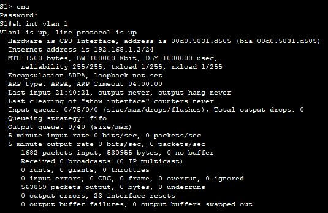
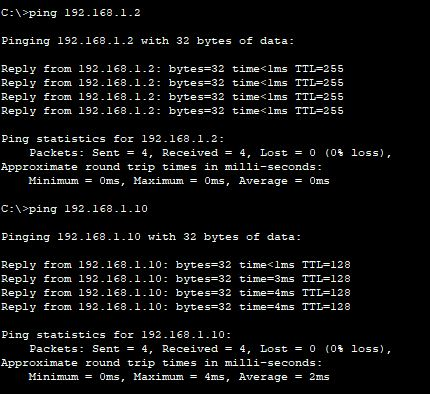

Лабораторная работа. Базовая настройка коммутатора 

# Таблица адресации

| Устройство | Интерфейс | IP-адрес / префикс |
| --- | --- | --- |
| S1  | VLAN 1 | 192.168.1.2 /24 |
| PC-A| NIC    | 192.168.1.10 /24|

######Задачи

Часть 1. Проверка конфигурации коммутатора по умолчанию
Часть 2. Создание сети и настройка основных параметров устройства
•	Настройте базовые параметры коммутатора.
•	Настройте IP-адрес для ПК.
Часть 3. Проверка сетевых подключений
•	Отобразите конфигурацию устройства.
•	Протестируйте сквозное соединение, отправив эхо-запрос.
•	Протестируйте возможности удаленного управления с помощью Telnet.

####Подключимся консольным кабелем к коммутатором и настроим основные параметры

interface Vlan1

 ip address 192.168.1.2 255.255.255.0

ip default-gateway 192.168.1.1

line con 0
 password 7 00071A150754
 logging synchronous
 login

line vty 0 4

 password 7 121A0C041104
 login

line vty 5 15

 password 7 121A0C041104
 login

Почему нужно использовать консольное подключение для первоначальной настройки коммутатора? Почему нельзя подключиться к коммутатору через Telnet или SSH?

Потому что первоначально не сможешь зайти по другому

####Настроим ip адрес на хосте

)

Сколько интерфейсов FastEthernet имеется на коммутаторе 2960?

FastEthernet - 24

Сколько интерфейсов Gigabit Ethernet имеется на коммутаторе 2960?

Gigabit Ethernet 2

no ip domain-lookup

hostname S1

service password-encryption

enable secret class

banner motd #
Unauthorized access is strictly prohibited. #

Шаг 1. Отобразите конфигурацию коммутатора.

S1#sh running-config 
Building configuration...

Current configuration : 1351 bytes
!
version 15.0
no service timestamps log datetime msec
no service timestamps debug datetime msec
service password-encryption
!
hostname S1
!
enable secret 5 $1$mERr$9cTjUIEqNGurQiFU.ZeCi1
!
!
!
no ip domain-lookup
!
!
!
spanning-tree mode pvst
spanning-tree extend system-id
!
interface FastEthernet0/1
!
interface FastEthernet0/2
!
interface FastEthernet0/3
!
interface FastEthernet0/4
!
interface FastEthernet0/5
!
interface FastEthernet0/6
!
interface FastEthernet0/7
!
interface FastEthernet0/8
!
interface FastEthernet0/9
!
interface FastEthernet0/10
!
interface FastEthernet0/11
!
interface FastEthernet0/12
!
interface FastEthernet0/13
!
interface FastEthernet0/14
!
interface FastEthernet0/15
!
interface FastEthernet0/16
!
interface FastEthernet0/17
!
interface FastEthernet0/18
!
interface FastEthernet0/19
!
interface FastEthernet0/20
!
interface FastEthernet0/21
!
interface FastEthernet0/22
!
interface FastEthernet0/23
!
interface FastEthernet0/24
!
interface GigabitEthernet0/1
!
interface GigabitEthernet0/2
!
interface Vlan1
 ip address 192.168.1.2 255.255.255.0
!
ip default-gateway 192.168.1.1
!
banner motd ^C
Unauthorized access is strictly prohibited. ^C
!
!
!
line con 0
 password 7 00071A150754
 logging synchronous
 login
!
line vty 0 4
 password 7 121A0C041104
 login
line vty 5 15
 password 7 121A0C041104
 login

####Проверьте параметры VLAN 1

Шаг 2. Протестируйте, отправив эхо-запрос сквозное соединение.
a.	В командной строке компьютера PC-A с помощью утилиты ping проверьте связь сначала с адресом PC-A.
C:\> ping 192.168.1.10 
b.	Из командной строки компьютера PC-A отправьте эхо-запрос на административный адрес интерфейса SVI коммутатора S1.
C:\> ping 192.168.1.2

